# 🛒 ShopNOW (E-commerce Website)

## by Vinod S M

## i built this to understand how the servlets and jsp lead to spring and spring boot. learning value 8/10(for me).

## 📌 About
This is a full-featured ** ShopNOW - an Online Shopping Web Application** built using **Java (Servlets & JSP)**, **JDBC**, **MySQL**, **HTML**, **CSS**, and **Bootstrap**. The platform supports both **users** and **admins**, offering user authentication, dynamic product browsing, cart management, order processing, and admin control.

---

## 👥 User Features

- 🔐 **Sign Up & Login**
  - Users can register and log in securely.
  - Admins must log in with:
    - **Email**: `admin@gmail.com`
    - **Password**: `admin`

- 🔐 **User Authentication**
  - cheks user and password for authentication
  

- 🛍️ **Product Browsing**
  - View all available products on the home page.
  - Add items to cart and view/update/delete cart items.

- 📦 **Order Processing**
  - Proceed to checkout.
  - Enter/change delivery address.
  - View order confirmation and history.

- 🧑 **Profile Management**
  - Update personal information.
  - Access order history and messages.
  - Visit the “About” section.

- 🚪 **Logout**

---

## 👨‍💼 Admin Features

- ✅ **Admin Login**
- ➕ **Add Products**
- 🛠️ **Edit or Delete Products**
- 📬 **View Messages from Users**
- 📦 **Manage Orders** – Mark as Delivered or Cancel
- 📈 **View Received Orders**
- 🚪 **Logout**

---

## 🖼️ Screenshots

### 👤 User Side

| Page             | Screenshot                                 |
|------------------|---------------------------------------------|
| Home Page        | 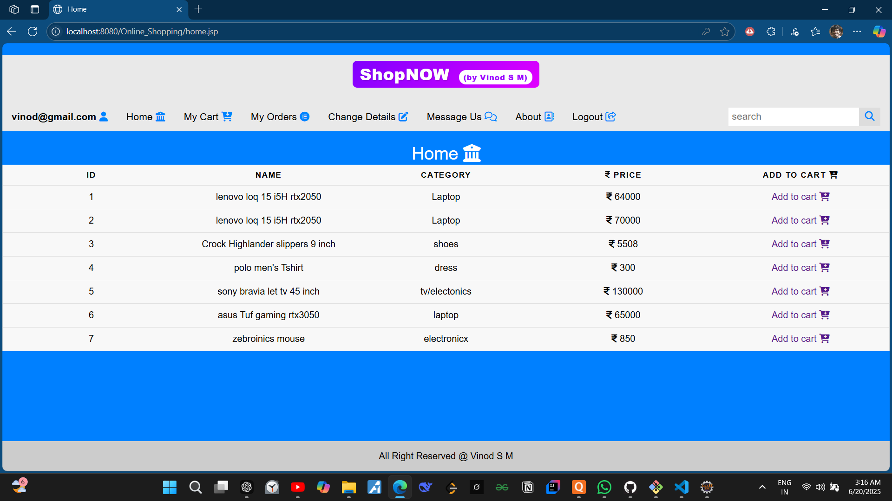                  |
| Login Page       | 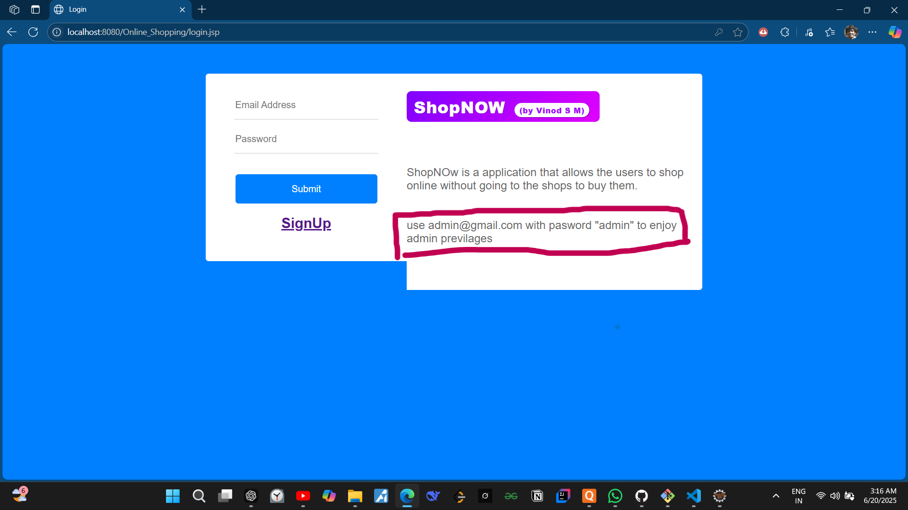                 |
| My Cart          | 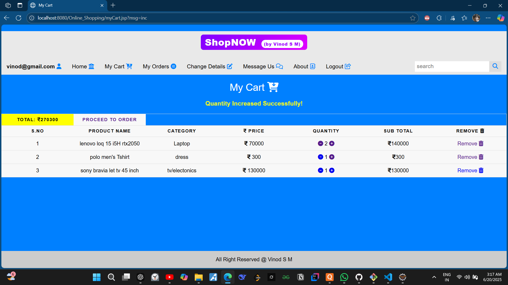                |
| My Orders        | 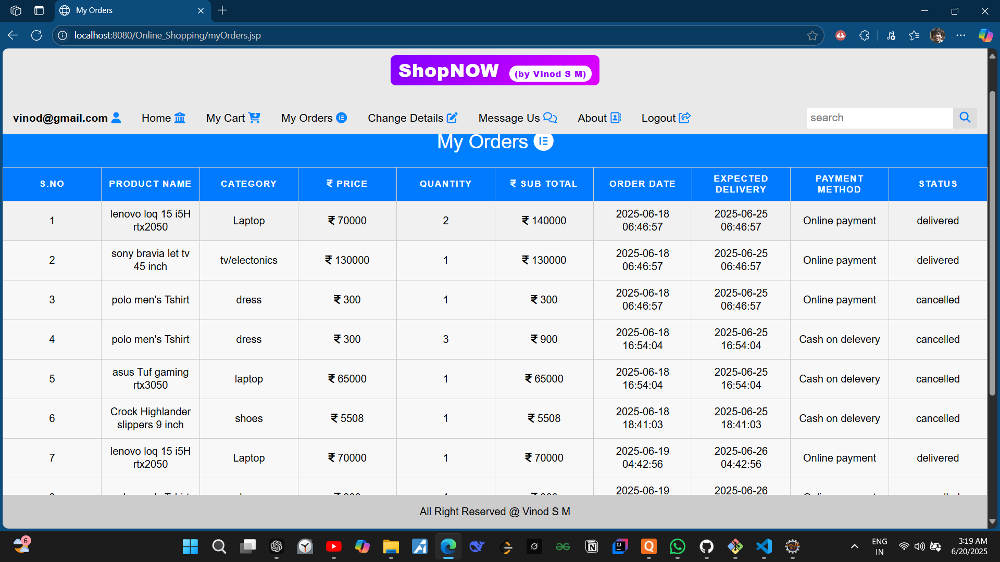              |
| Message Page     | 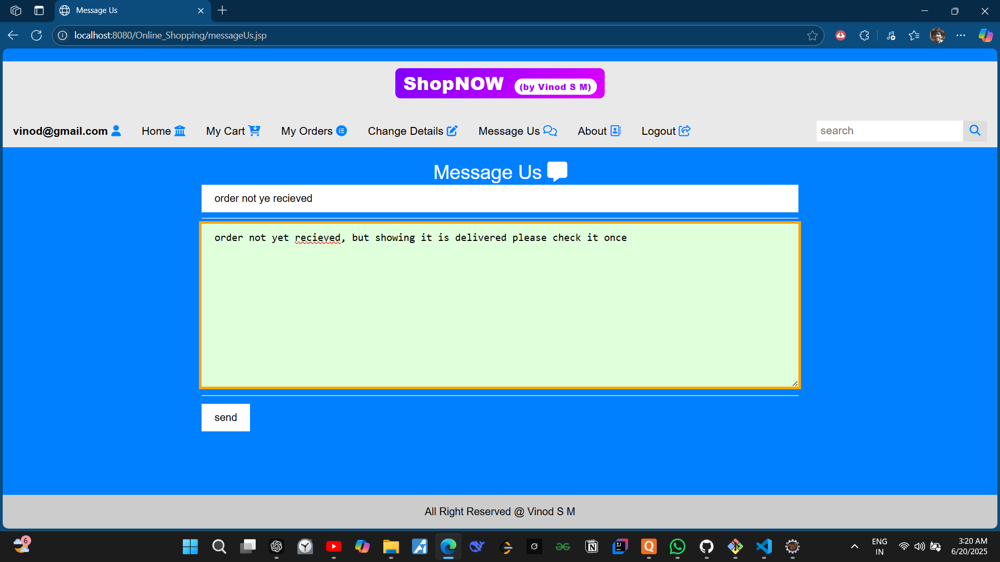               |
| About Page       | 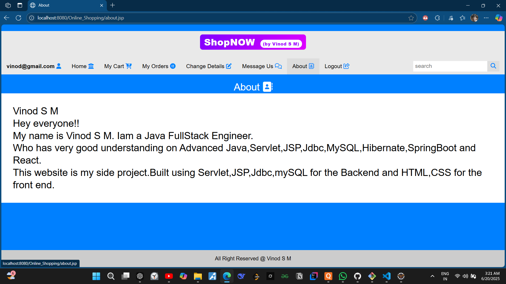                 |
| Change Details   | 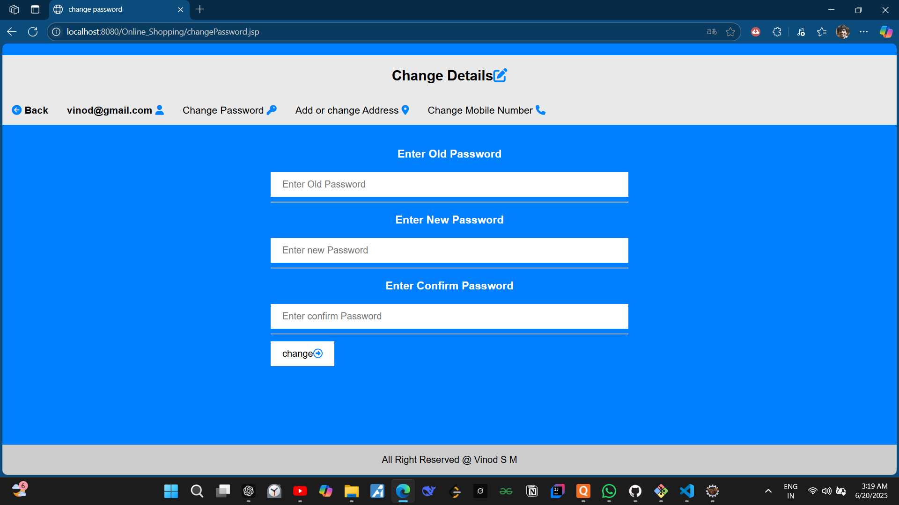                |

---

### 🧑‍💼 Admin Side

| Page                  | Screenshot                                 |
|------------------------|---------------------------------------------|
| Add New Product        | 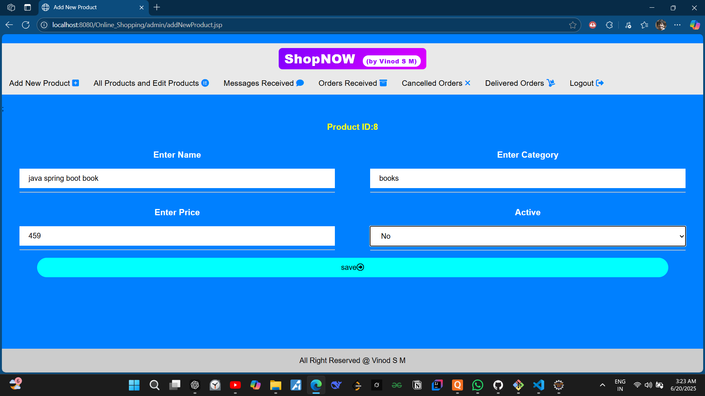                 |
| Edit/Delete Products   | 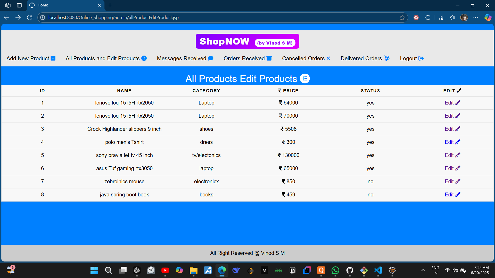           |
| Received Orders        | 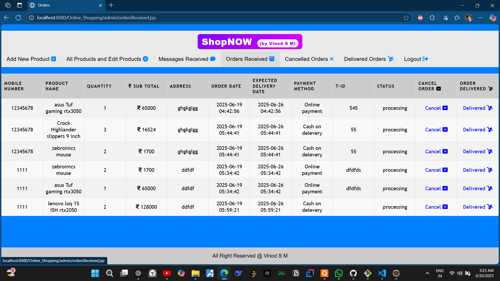        |
| Delivered Orders       | 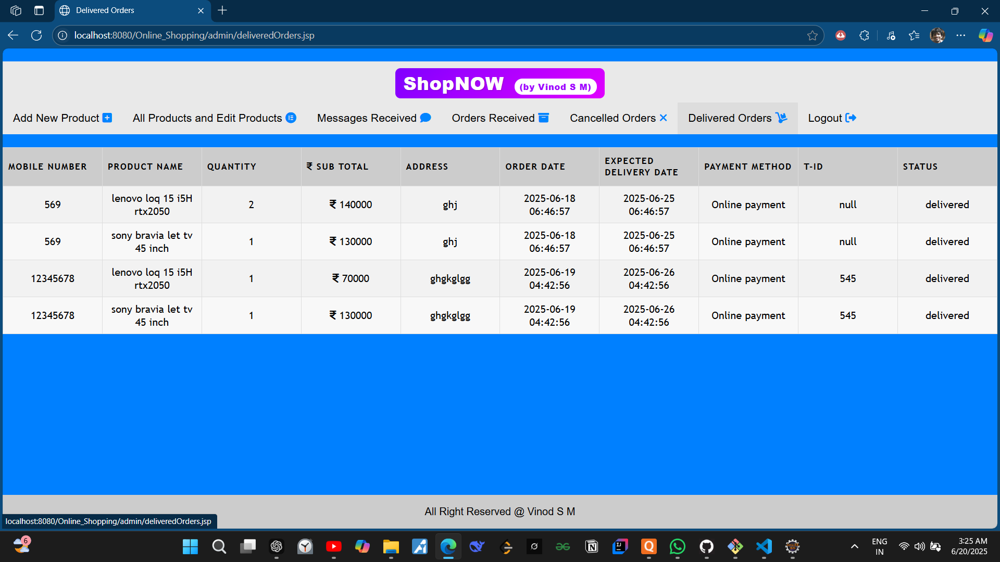            |
| Messages Received      | 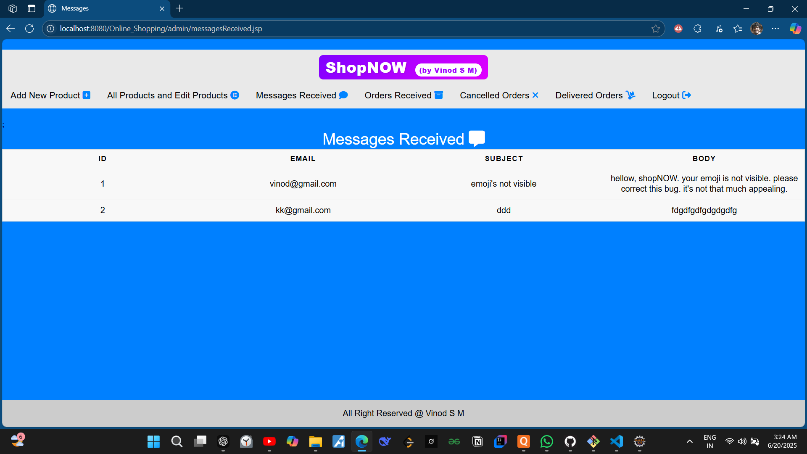     |

---

## 🛠️ Technologies Used

### 💻 Frontend
- HTML5
- CSS3
- Bootstrap
- JSP

### ⚙️ Backend
- Java (Servlets)
- JDBC

### 🗄️ Database
- MySQL 8.0

### ☁️ Server & Tools
- Apache Tomcat 10
- Eclipse IDE for Enterprise Java
- Git & GitHub

---

## 📂 Project Structure

Online Shopping/
│
├── src/
│ └── main/
│ ├── java/
│ │ └── com/
│ │ ├── admin/ # Admin servlets
│ │ ├── user/ # User servlets
│ │ └── util/ # Database utilities
│ └── webapp/
│ ├── admin/ # Admin JSPs
│ ├── css/ # Styles
│ ├── WEB-INF/ # Web config
│ └── *.jsp # JSP pages
├── screenshots/ # Project screenshots
├── .gitignore
├── README.md
└── ...

---

## 📬 Contact

For queries or collaborations, feel free to reach out:

- GitHub: [VinodNaik01](https://github.com/VinodNaik01)
- Email: `vinodsm510@gmail.com`

---

## 🌟 Show some love!

If you found this project helpful, please ⭐ star this repo and follow for more!

